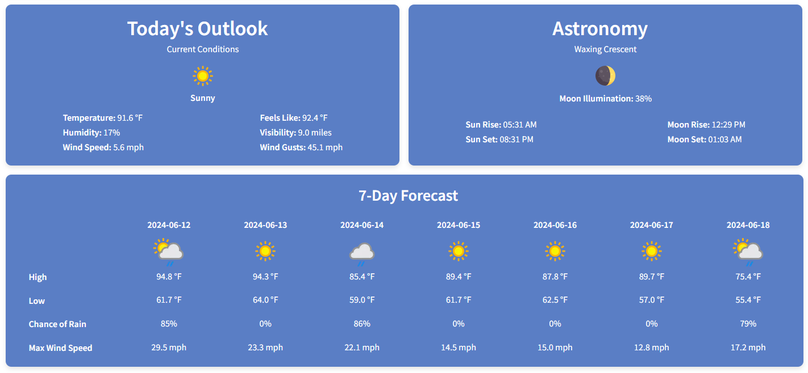

# Weather Web App

Welcome to my Weather Web App project! This project is a web-based application built with [Streamlit](https://streamlit.io/), using free API's to detect a user's location, and provide weather data based on that location.

## Published Location
Access the published web app [here.](https://rwend-weather-app.streamlit.app/)

## Screenshots
Here is a preview of the web if you have not access the published site yet:


## Known Issues
The published version is obtaining the IP address of the server it is hosted on. Streamlit has disabled client-side IP logging for privacy reasons, I included a user input location override but to get the auto-location detection working you will need to install and run the app locally.

## Local Installation
To run this dashboard locally, follow these steps:

1. **Clone the Repository**
    ```sh
    git clone https://github.com/rd-wendling/weather.git
    cd weather
    ```

2. **Install Dependencies**
    Make sure you have Python installed (this was created using version 3.11). Then, install the required Python packages:
    ```sh
    pip install -r requirements.txt
    ```

3. **Run the Application**
    ```sh
    streamlit run app.py
    ```

Once the application is running, open your web browser and navigate to `http://localhost:8501` to view the dashboard.

### Command Line Options
- `--server.port`: Specify the port to run the application (default is 8501).
- `--server.headless`: Run the server in headless mode (useful for deployment).
